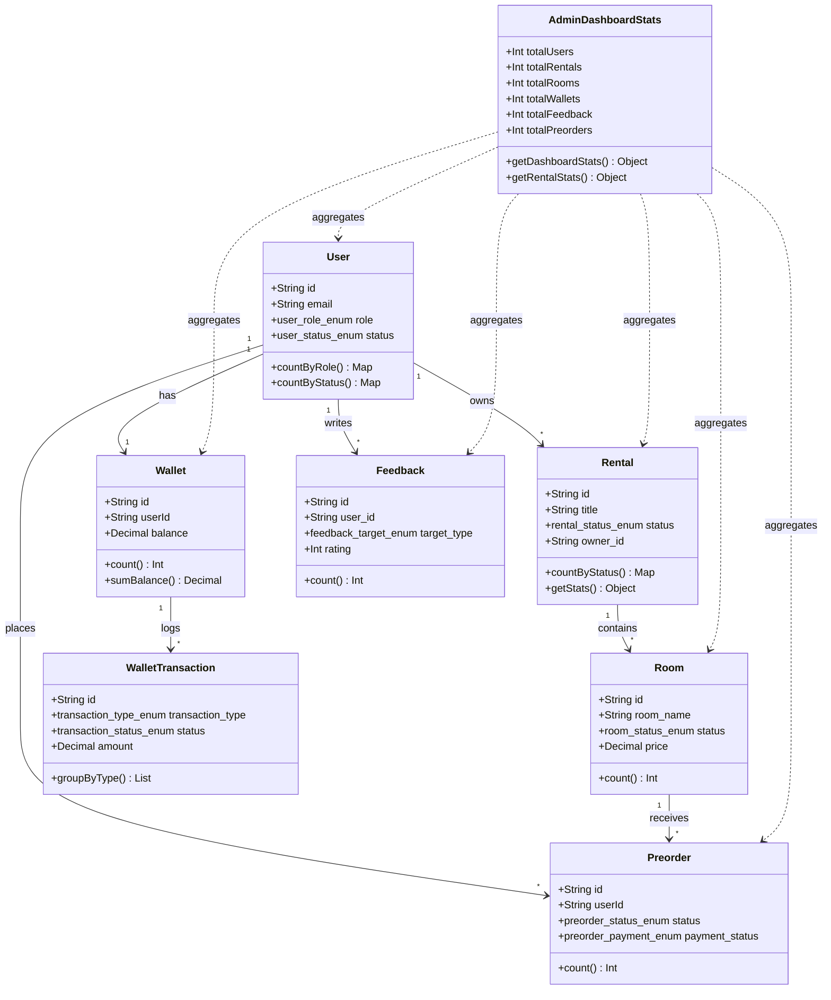

# Dashboard - Thống kê tổng quan: Class Diagram

Biểu đồ lớp mô tả các thực thể liên quan đến chức năng Dashboard (`GET /admin/stats`, `GET /rentals/stats`).

```mermaid
classDiagram
    class User {
        +String id
        +String email
        +user_role_enum role
        +user_status_enum status
        +countByRole() Map
        +countByStatus() Map
    }

    class Rental {
        +String id
        +String title
        +rental_status_enum status
        +String owner_id
        +countByStatus() Map
        +getStats() Object
    }

    class Room {
        +String id
        +String room_name
        +room_status_enum status
        +Decimal price
        +count() Int
    }

    class Wallet {
        +String id
        +String userId
        +Decimal balance
        +count() Int
        +sumBalance() Decimal
    }

    class WalletTransaction {
        +String id
        +transaction_type_enum transaction_type
        +transaction_status_enum status
        +Decimal amount
        +groupByType() List
    }

    class Feedback {
        +String id
        +String user_id
        +feedback_target_enum target_type
        +Int rating
        +count() Int
    }

    class Preorder {
        +String id
        +String userId
        +preorder_status_enum status
        +preorder_payment_enum payment_status
        +count() Int
    }

    class AdminDashboardStats {
        +Int totalUsers
        +Int totalRentals
        +Int totalRooms
        +Int totalWallets
        +Int totalFeedback
        +Int totalPreorders
        +getDashboardStats() Object
        +getRentalStats() Object
    }

    User "1" --> "*" Rental : owns
    User "1" --> "1" Wallet : has
    Wallet "1" --> "*" WalletTransaction : logs
    Rental "1" --> "*" Room : contains
    User "1" --> "*" Feedback : writes
    User "1" --> "*" Preorder : places
    Room "1" --> "*" Preorder : receives
    AdminDashboardStats ..> User : aggregates
    AdminDashboardStats ..> Rental : aggregates
    AdminDashboardStats ..> Room : aggregates
    AdminDashboardStats ..> Wallet : aggregates
    AdminDashboardStats ..> Feedback : aggregates
    AdminDashboardStats ..> Preorder : aggregates
```
