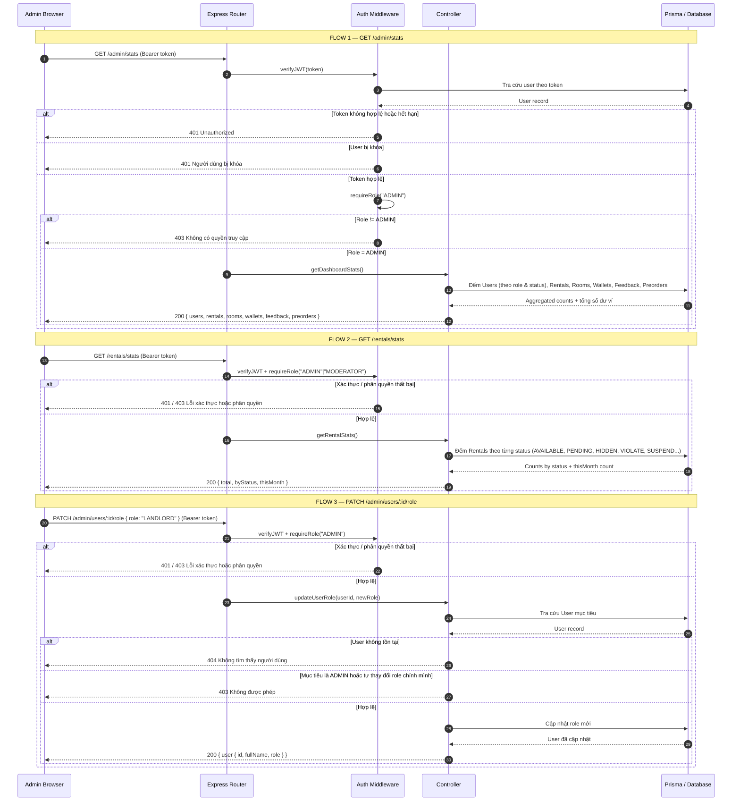

# Dashboard - Thống kê tổng quan: Sequence Diagram

Biểu đồ tuần tự mô tả luồng nghiệp vụ của chức năng Admin Dashboard (`GET /admin/stats`, `GET /rentals/stats`, `PATCH /admin/users/:id/role`).

```mermaid
sequenceDiagram
    autonumber

    participant Client as Admin Browser
    participant Router as Express Router
    participant Auth as Auth Middleware
    participant Ctrl as Controller
    participant DB as Prisma / Database

    %% =====================================================
    %% FLOW 1: Lấy thống kê tổng quan (GET /admin/stats)
    %% =====================================================
    Note over Client,DB: FLOW 1 — GET /admin/stats

    Client->>Router: GET /admin/stats (Bearer token)
    Router->>Auth: verifyJWT(token)
    Auth->>DB: Tra cứu user theo token
    DB-->>Auth: User record

    alt Token không hợp lệ hoặc hết hạn
        Auth-->>Client: 401 Unauthorized
    else User bị khóa
        Auth-->>Client: 401 Người dùng bị khóa
    else Token hợp lệ
        Auth->>Auth: requireRole("ADMIN")
        alt Role != ADMIN
            Auth-->>Client: 403 Không có quyền truy cập
        else Role = ADMIN
            Router->>Ctrl: getDashboardStats()
            Ctrl->>DB: Đếm Users (theo role & status), Rentals, Rooms, Wallets, Feedback, Preorders
            DB-->>Ctrl: Aggregated counts + tổng số dư ví
            Ctrl-->>Client: 200 { users, rentals, rooms, wallets, feedback, preorders }
        end
    end

    %% =====================================================
    %% FLOW 2: Thống kê bài đăng (GET /rentals/stats)
    %% =====================================================
    Note over Client,DB: FLOW 2 — GET /rentals/stats

    Client->>Router: GET /rentals/stats (Bearer token)
    Router->>Auth: verifyJWT + requireRole("ADMIN"|"MODERATOR")

    alt Xác thực / phân quyền thất bại
        Auth-->>Client: 401 / 403 Lỗi xác thực hoặc phân quyền
    else Hợp lệ
        Router->>Ctrl: getRentalStats()
        Ctrl->>DB: Đếm Rentals theo từng status (AVAILABLE, PENDING, HIDDEN, VIOLATE, SUSPEND...)
        DB-->>Ctrl: Counts by status + thisMonth count
        Ctrl-->>Client: 200 { total, byStatus, thisMonth }
    end

    %% =====================================================
    %% FLOW 3: Quản lý user — đổi role (PATCH /admin/users/:id/role)
    %% =====================================================
    Note over Client,DB: FLOW 3 — PATCH /admin/users/:id/role

    Client->>Router: PATCH /admin/users/:id/role { role: "LANDLORD" } (Bearer token)
    Router->>Auth: verifyJWT + requireRole("ADMIN")

    alt Xác thực / phân quyền thất bại
        Auth-->>Client: 401 / 403 Lỗi xác thực hoặc phân quyền
    else Hợp lệ
        Router->>Ctrl: updateUserRole(userId, newRole)
        Ctrl->>DB: Tra cứu User mục tiêu
        DB-->>Ctrl: User record

        alt User không tồn tại
            Ctrl-->>Client: 404 Không tìm thấy người dùng
        else Mục tiêu là ADMIN hoặc tự thay đổi role chính mình
            Ctrl-->>Client: 403 Không được phép
        else Hợp lệ
            Ctrl->>DB: Cập nhật role mới
            DB-->>Ctrl: User đã cập nhật
            Ctrl-->>Client: 200 { user { id, fullName, role } }
        end
    end
```
